# Proiectul
Acesta propune implementarea unei aplicații web pentru utilizatorii care sunt dispuși să învețe bunele maniere sub o forma interactivă.
# Soluția
Noi ne-am propus ca modul de dispunere al acesteia sa fie sub forma site-ului W3SCHOOLS. La terminarea oricărei lecții utilizatorul sa răspundă la o întrebare pentru acumularea scorului (in functie de dificultatea întrebării). Acesta poate intra sa caute si sugestii in functie de anumite situații cu care se confruntă, la care aplicația ii oferă răspunsuri pe baza anumitor criterii ce țin de profilul acestuia, cat si în funcția de cerințele sale.
# Bonusuri
Aplicația noastră dispune de 2 tipuri de utilizatori: useri si admini. Administratorul are mai multe facilități decât utilizatorul de rând. Acesta poate gestiona aplicația prin felurite moduri. Are 3 mari adaosuri: adăugare sau ștergerea de sugestii, lecții, categorii SI acceptarea/ respingerea personalelor ce vor sa aplice ca administratori.
Aplicația are si această funcționalitate de a aplica ca administrator. De asmenea, ii ofera utilizatorului si posibilitatea de a-si modifica profilul in funcție de preferințele sale.
De asemenea, pentru categoriile noi (lectiile si afisarea lor) folosește REST API.
# Limbaje utilizate
S-au folosit : HTML5, CSS pentru scheletul acesteia. Pe parcursul implementării au mai fost folosite si Javascript, PHP , Ajax (pentru conectarea acestora). Pe lângă asta, s-au folosit 2 tipuri de fișiere: XML si JSON. 
Baza de date folosita este cea de MariaDB/MySql din phpadmin. Am folosit SQL in utilizarea si prelucrarea datelor din aceasta.
Pentru folosirea localhost-ului, s-a utilizat XAMPP (necesar utilizării PHP-ului).
# Modul de implementare al aplicației
## Frontend
Acesta a fost implementat mai repede pentru că aplicația sa aiba o structură compactă. E necesar un schelet necesar stabil pentru a implementa backend-ul. Ulterior a suferit anumite modificări în funcție de sugestiile profesorului (care au fost luate in considerare pentru funcționalitățile site-ului).
## Autentificarea / Înregistrarea
Aceste doua etape au fost cele de început ca sunt necesare într-o aplicație web, ce servește la evidențierea unui scor (ce are un top) si modul de parcurgere a lecțiilor. Este necesară pentru experiența utilizatorului.
### Autentificarea
Aceasta consta in utilizarea email-ului si parolei ce urmează a fi verificate in baza noastră de date: tabelul users. Parola introdusă in campul password, este criptată si verificata cu ceea ce se afla in tabel. Asta va reprezenta un adaos securității aplicației noastre , pentru a menține datele utilizatorilor in siguranță.
După verificările respective, acesta urmează a fi trimis pe pagina inițială a site-ului.
Verificarea se face in PHP, prin trimiterea formularului.
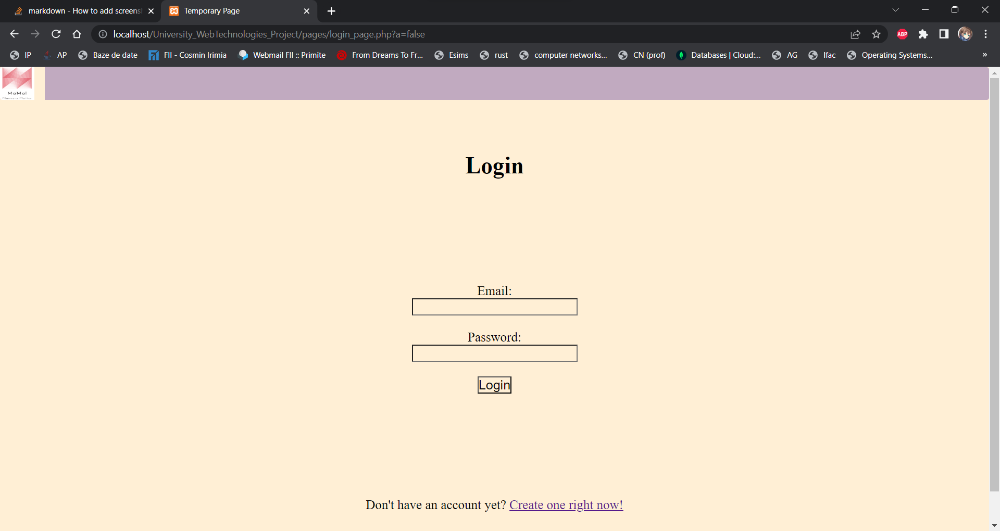
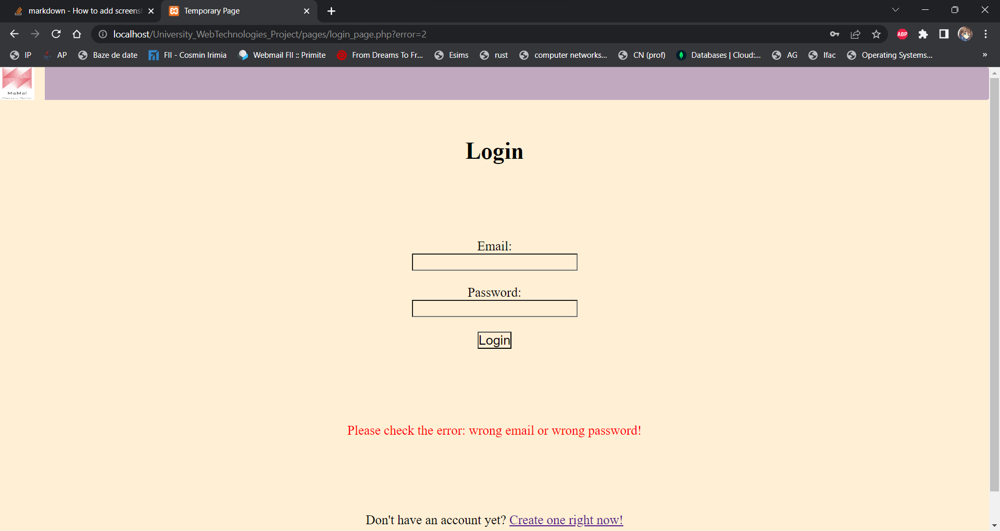
### Înregistrarea
Aceasta se face prin introducerea unor elemente de baza ce tin de utilizatorul nostru: email, parola, numele, prenumele si dorinta de a aplica ca administrator/nu. Daca nu doreste acum, va avea posibilitatea sa aplice si ulterior din nou. Dupa completarea câmpurile, acesta va fi redirecționat către pagina de logare, cu un mesaj ce ii spune că informațiile sale au fost salvate in baza de date.
De asemenea, trimiterea se face in PHP, iar emailul este verificat ca sa nu coincidă cu unul deja existent. Acesta are caracter unic. Campurile nu pot fi goale, de asemenea.
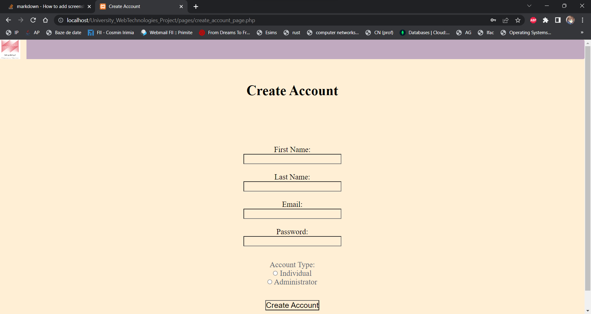
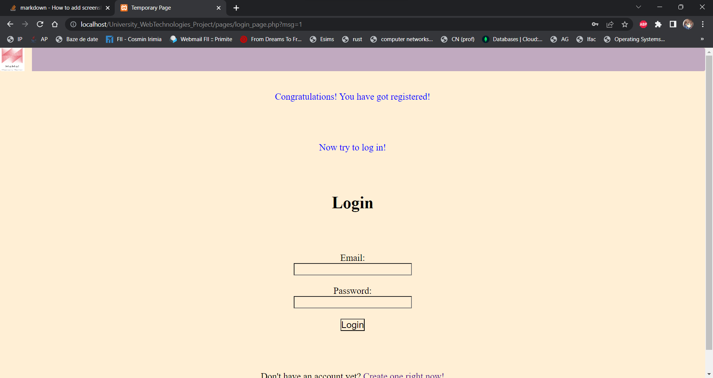
## Afisarea scorului / Tabela de scor
Aceasta afișează top 9 cei mai "activi" utilizatori ce folosesc aplicația noastră. Daca nu exista numărul respectiv de persoane, in câmpurile necesare se vor afisa doar "-" . 
Pe lângă ca sunt afișați în funcție de scorul lor, ordinea rămâne alfabetică pentru obținerea unui top corect, ce respectă anumite criterii.
Mai mult decât atat, mai in jos se va putea afișa si scorul utilizatorului curent, alături de locul pe care acesta il are in clasamentul întreg (nu-i necesar sa fie in top 9).
Aici s-a folosit tabelul de users , alături de logica ce tine de SQL si PHP pentru găsirea datelor necesare.
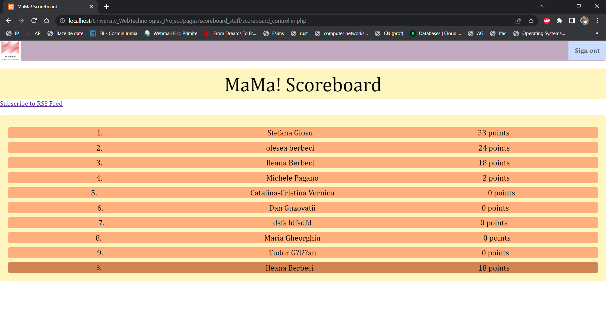
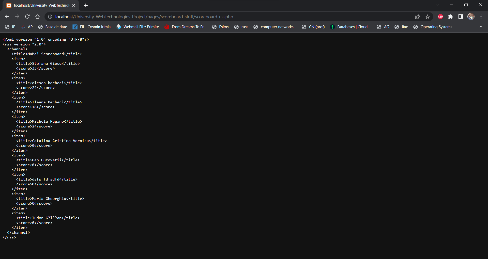
## Verificarea că utilizatorul a terminat lectia
Asta a fost considerat a avea o prioritate mai ridicată decât ceea ce tine in verificarea răspunsului la o întrebare. Il ajuta pe utilizator sa vada cand a terminat o lecție si când nu mai poate răspunde la ea încă o dată.
Datele sunt salvate într-un JSON sub forma:
- nume categorie:
- lectii:[
- - nume lectie:
- - email-urile ce au completat lectia respectiva:
]

Partea interesantă ce tine de acest JSON este ca isi da update automat, in caz ca , categoria sau lecția nu exista inca in acesta, el le crează automat pentru lipsa de implicare a administratorului in ceea ce tine de datele si modul de parcurgere al lecțiilor.
Partea aceasta este in strângă legătură cu următoarea. Acolo se vor explica mai multe ce tin de secvență curenta.
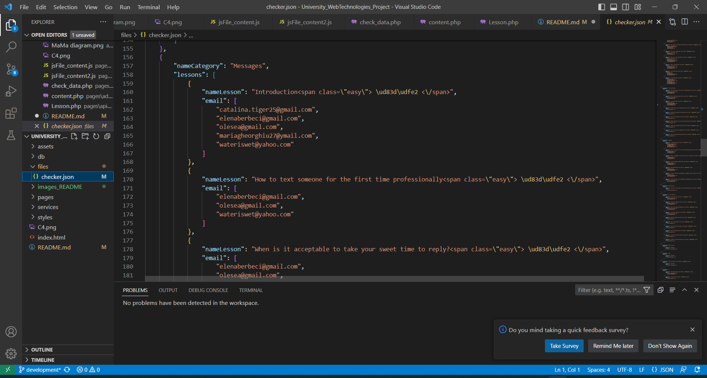
## Verificarea ca a răspuns la intrebarea respectivă corect
Aceasta este importanta pentru ajustarea scorului. In primul rând, după finisarea citirii / documentarii utilizatorul, acesta este pus să răspundă la o întrebare. Aceasta are diferite dificultăți în funcție de lectia respectivă. O lectie poate fi ușoară: 🟢 , medie: 🟡 , grea: 🔴. Acestea apar lângă lecția curentă pentru a-i oferi utilizatorilor informația in legatura cu dificultatea lecției. Pentru fiecare categorie se ofera un numar exact de puncte: 2p, 5p si 10p. Se verifica intrebare, utilizatorul primeste răspunsul de "corect" sau "greșit". Poate sa îl modifice ulterior că lecția si scorul nu pot fi actualizate dacă răspunsul nu este corect. Aplicația iti spune in caz de ceva, ca, răspunsul trebuie sa fie corect pentru ca să primești punctele.
Dupa ce se răspunde corect, utilizatorul va primi jos mesajul cu "ai terminat lectia" si o casetă de `alert` in care se afișează valoarea întrebării si noul sau scor.
Daca se reîncearca terminarea lectiei, aplicația va spune ca deja ai terminat-o.
Toate aceste lucruri se fac in:
- JS - pe frontend 
- PHP - pe backend
- Ajax (fara framework-ul jQuery, ci prin xmlhttp) pentru a le conecta
- JSON-ul pentru verificarea e-mailurilor ce deja au făcut această lectie (a fost completată)

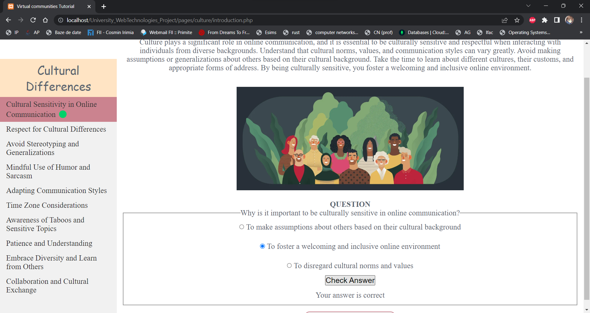

## Acceptarea/ Respingerea de aplicările de admini
In Admin Commands, un administrator are posibilitatea de a respinge sau accepta persoanele ce aplică sa devina administratori la înregistrarea unui cont. In pagina respectiva exista butonul `Admin` ce redirecteaza administratorul catre o pagină nouă cu aplicații noștrii. Ei vor fi afișați sub forma:
- Prenume Nume id
- 2 imagini (de acceptare si respingere)
In funcție de alegerea administartorului, persoana respectiva va fi acceptata (role-ul sau va deveni `admin`) sau respins (va fi doar eliminat din lista respectiva fara vreo modificare in baza de date).
Aceasta pagina se desfășoară dinamic -> acceptarea / stergerea unui utilizator se face instant prin stergerea acestuia din lista respectivă.
In caz ca nu mai sunt utilizatori de acceptat, se va afișa, `there is none`.
S-a utilizat PHP in concordanță cu SQL pentru luare si verificarea rezultatelor. Se iau 2 cazuri, de acceptare si respingere.
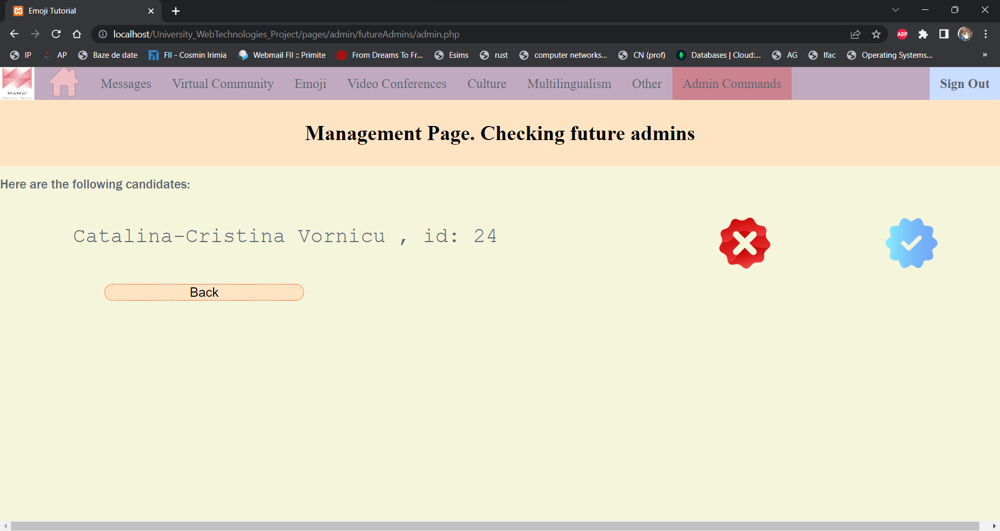
## Introducerea/ Stergerea unei categorii
Am inceput sa ne gândim ca si administratorii au dreptul la niste funcționalități in plus. De aceea, am introdus facilitatea de a putea sterge, adăuga o categorie noua, ce va fi in introdusa in `OTHER` . Cand se intra pe Admin Commands, sunt 2 butoane : `Add` si `Delete`. In care se adaugă/ se sterg elemente din aplicația respectivă.
Primele din lista sunt categoriile. Se adaugă numele acestora din lista respectivă, pentru a fi ștearsă, cat introducerea unui nou nume ce va fi verificat (sa fie unic) si mai apoi adăugat in baza de date. 
Pentru această parte, ce tine de ele s-a utilizat PHP in totalitate.
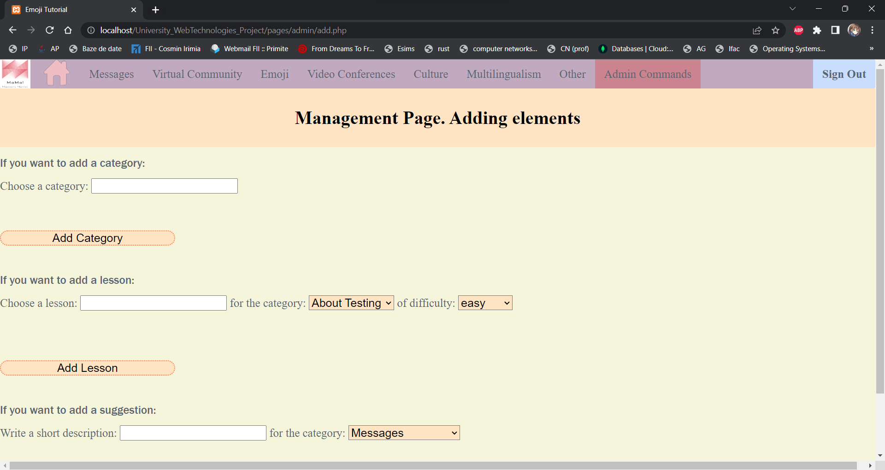
## Introducerea / Ștergerea unei lecții
### Ștergerea unei lecții
In funcție de categoria selectată, se afișează lecțiile disponibile ce pot fi șterse. Aceasta se modifică in functie de categoria aleasă. Pentru categoriile ce nu au nici o lectie disponibila, nu se va putea afișa nimic. Spațiul va fi gol.
S-a utilizat:
- JS pe frontend
- PHP pe backend
- Ajax pentru legătură 
- SQL pentru baza de date
Dupa selectarea opțiunii si click-ul pe butonul respectiv, lectia va fi ștearsă alaturi de toate sugestiile ce le are.
De asemenea, lecțiile ce tin de meniul paginii / aplicației nu vor apare ca sa poata fi sterse, precum si categoriile respective.
Acestea vor fi menținute asa.
###Introducerea unei lecții
Utilizatorul selectează lectia ce doreste a fi adăugată, se verifica unicitatea acesteia din categoria respectiva. Daca totul este in conformitate cu regulile respective , utilizatorul este redirectionat către o noua pagina, numita `content.php` pentru a putea introduce informațiile ce țin de lecția respectivă.
Inițial vor fi urmatoarele câmpuri:
- header
- content
- image
- question
- 4 options
- answer
Ulterior, se vor putea de adăugat alte 10 elemente : (header + content) sau image. Acest counter descrește de fiecare data până utilizatorul rămâne fara numarul respectiv de adăugări. Mesajul se conturează cu roșu si îi oprește libertatea de a mai adauga conținut.
La trimiterea formularului (prin Ajax) se verifica completatea tuturor câmpurilor inițiale, cat si verificarea urmatoarelor lucruri:
- optiunile sa fie diferite
- raspunsul sa fie un numar <= decât numarul de optiuni completate
Daca trece pragul de verificari, lectia va fi adăugată cu succes, iar utilizatorul va primi un mesaj cu încărcarea ei.
Daca acesta și-a dat seama ca vrea sa modifice ceva, poate face asta si sa retrimita formularul, pe urma (după verificările necesare) va primi iar un mesaj cu `lectia a fost actualizata`.
S-au folosit:
- JS pe frontend
- PHP pe backend
- Ajax pentru conexiunea dintre ele (forma sa de POST)
- SQL pentru lucrul cu baza de date
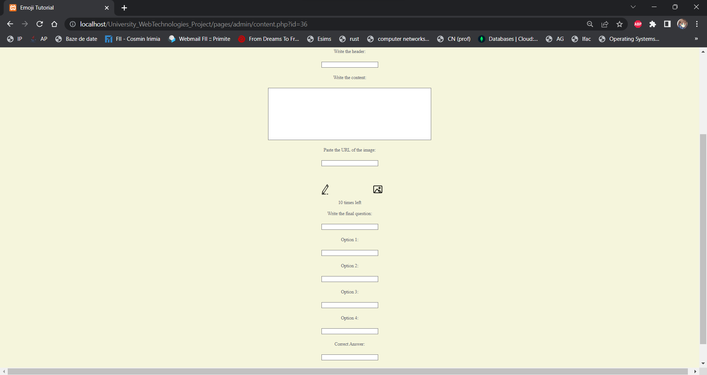
## Sugestiile
### Alegerea sugestiilor
Acestea sunt pe pagina principala a aplicației la `suggestions` . Aici utilizatorul poate sa își aleagă o categorie din care face parte sugestia respectivă. In functie de aceasta, se vor afișa sugestiile disponibile oferite de aplicație. Se va lua in considerare căsuța selectata `formal`/`informal` si genul persoanei respective. In caz nu are trecut unul, se vor afisa pentru ambele genuri, sugestiile din căsuța bifata.
Prin acest mod, utilizatorul nostru va putea primi întrebări in funcție de necesitățile sale.
Acestea sunt luate dintr-un XML ce este de forma
- <root>
- <sID_SUGGESTION>
- <modul de adresare: informal|formal>
- <genul persoanei: male|female>
....
Aici s-au utilizat:
- JS pe frontend 
- PHP pe backend
- Ajax pentru conectarea lor
- XML pentru prelucrarea datelor
- SQL pentru verificarea lor din baza de date
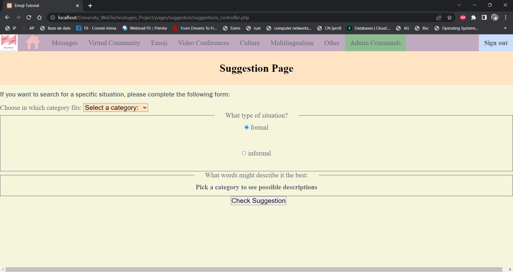
### Introducerea/ Ștergerea sugestiilor
La fel, ca in cazul lecțiilor acestea respectă acelasi principiu, mai putin cand vine vorba de introducerea lor.
1. Cand sunt adaugate noile sugestii: este verificată unicitatea lor in categoria respectiva 
2. Se deschide o noua pagina in care administartorului este rugat sa completeze câmpurile:
- informal
- - female
- - male
- formal
- - female
- - male
Care ulterior vor fi introduse in XML-ul respectiv, cat si in baza de date(aceasta intamplandu-se prima data).
Au fost folosite
- JS pe frontend
- PHP pe backend
- Ajax pentru conectarea in timp real a sugestiilor din categoria aleasă
- XML pentru introducerea de sugestii noi / ștergerea lor
- SQL pentru introducerea de sugestii noi / ștergerea lor
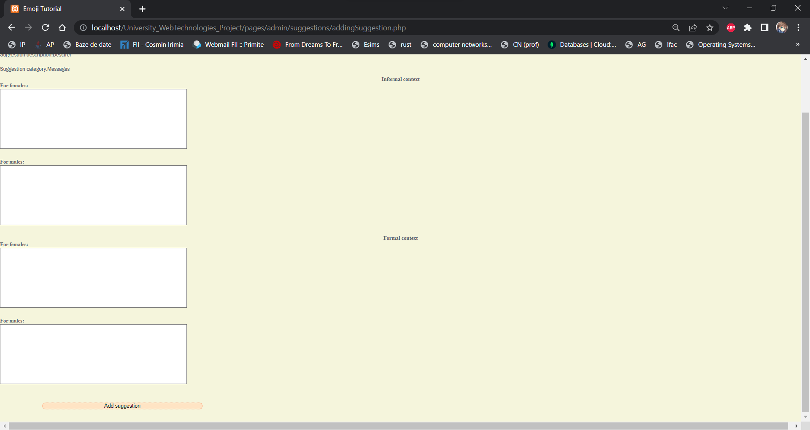
## OTHER
Acest loc este pentru categoriile noi introduse de administratorii site-ului. Aici se implementează toată aplicația in manieră de REST API. La baza ei sunt niste clase in PHP ce se ocupă cu afișarea categoriilor in pagina respectiva. Acestea sunt afișate in ordinea alfabetică delimitate de litera cu care încep.
De aici se poate selecta categoria dorită, redirectand utilizatorul pe pagina categoriei respective.

### Pagina categoriei
Aceasta ii întâmpină cu un mesaj de venire prin care li se spune daca aceasta are lectii disponibile sau nu. 
In partea stângă a ecranului se vor putea observa modul de introducere al lectiilor ce doresc a fi parcurse.
Prin selectarea uneia, utilizatorul va fi iar redirectionat către pagina lecției respective.
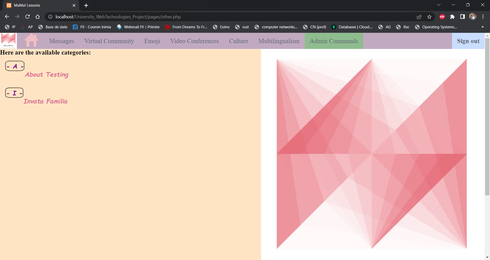

### Pagina lecției
Aceasta este compusă dintr-un schelet ce este actualizat în funcție de id-ul acesteia si id-ul categoriei respective.
Conține 2 div-uri mari: `titles` (ce sunt titlurile lecției pentru meniul din partea stângă) si `content` (pentru afișarea conținutului acesteia).
In josul paginii, se afla si întrebarea ce va fi verificată prin intermediul Ajax-ului ce va conecta cele doua limbaje: JS si PHP in găsirea soluției corecte.
Informațiile din tabela `content`  vor fi prelucrate in PHP prin deserializarea lor si parcurgerea pentru a putea fi construită lecția.
Procedeul de verificare al întrebărilor ține de aceleași principii ca in celelalte lecții `active`.
Aici doar se iau in considerare si căutarea id-ului bun al opțiunii pentru răspunsul întrebării, in rest totul este pe același principiu.
Aceasta se reactualizează in funcție de id-ul lectiei, cat si al categoriei.
Pentru categorii, se actualizează in functie de id-ul categoriei introduse.
Aici s-au folosit:
- REST API pentru modelarea lecției 
- JS pe frontend 
- PHP pe backend 
- Ajax pentru conectarea lor
- SQL pentru informațiile din tabela content 
- JSON pentru actualizarea informațiilor
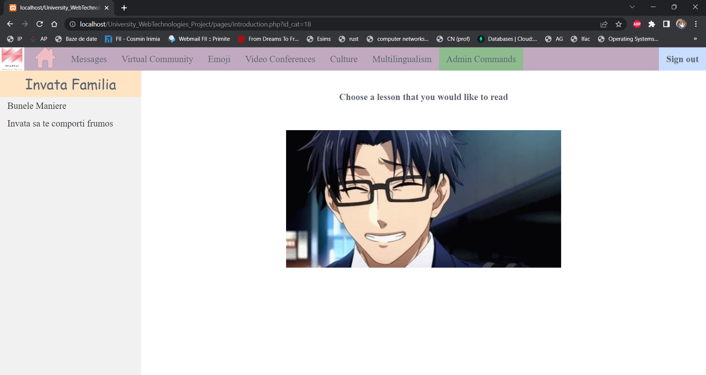

## Profilul
In profil se regasesc alte informații ce tin de utilizator, acestea vor putea fi modificate în funcție de placul acestuia.
Se vor actualiza automat dupa apăsarea butonului. 
In caz ca utilizatorul nu are completat un camp, acesta va afisa in `placeholder` valoarea ce tine de câmpul respectiv: ex "firstName".
Pentru a ajuta utilizatorul sa aiba un exemplu la cam ce ar trebui sa scrie in locul respectiv.
Acesta isi face actualizarea modificand baza de date instant. In caz ca utilizatorul nu este autentificat, el va primi mesajul de eroare.
Aici s-au folosit:
- PHP 
- SQL
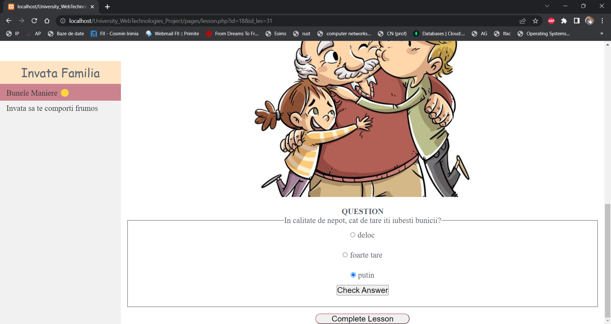

<<<<<<< Updated upstream
### Tasks
1. Create the database called `project`
2. Create the tables like in : https://docs.google.com/document/d/15mzF2AO19qKVUY87MHRoZNO1PCOv84kD5HTkh1ukZfA/edit?usp=sharing  (copy-paste)
3. For creating the admins: we will just create an account using our names and a password , for not forgetting about it, complete below (should be a proper email that contains `@gmail.com` or `@smth.com`)

*Maria*  
first name: Maria 
last name: Gheorghiu 
email: mariagheorghiu27@ymail.com 
password: admin123 

*Tudor*  
first name: Tudor 
last name: Gălățan 
email: tudorgalatan@gmail.com 
password: admin321 

*Catalina*  
first name: Catalina-Cristina 
last name:Vornicu 
email:catalina.tiger25@gmail.com 
password:admin123 

4. For checking the correctness of the email or making them as checked, we must remember that we will use Ajax and it will be learned at this lab12, so we will do this after 
5. Write `done` next to your name when you finished this first task

`Maria` : done 
`Tudor` : done 
`Catalina` : done 

## Details

Here is a link with the tasks backlog: https://github.com/users/tudorgalatan/projects/6/.

Here is a link for the video presentation: https://drive.google.com/file/d/1ExVIlM3C8xRh4xuEPKr6NfKcKZtlRfKi/view?usp=sharing
=======
# Concluzie
Prin acest proiect, au putut fi acumulate numeroase cunoștințe ce tin de domeniul WEB. Am aflata utilitatea unui REST API, cat de ușoară este folosirea acestuia pentru a evita multitudinea de fisiere de pe mașină. Pentru a ajuta dinamica paginii sa se plieze pe necesitatea utilizatorului, in functie de id-ul acestuia. Modul de template-izare pentru usuararea muncii este un factor important, cum se fac schimburile de informații prin metodele GET si POST. Am descoperit cum se conectează PHP cu JS, si cat de complex este procesul de lucru cu ambele.
>>>>>>> Stashed changes
